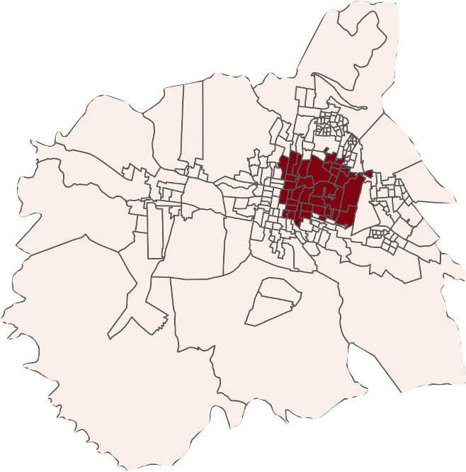
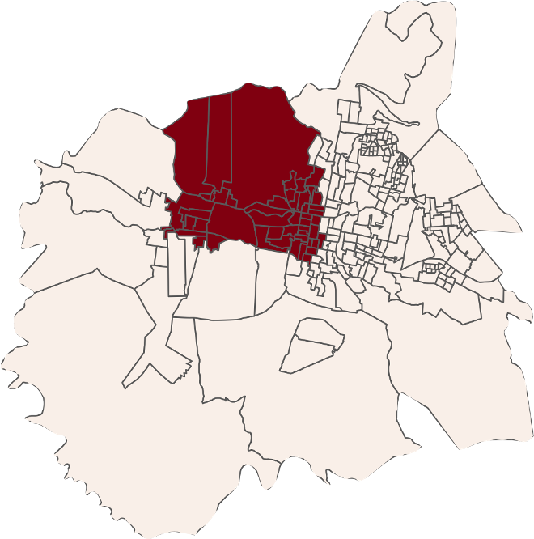
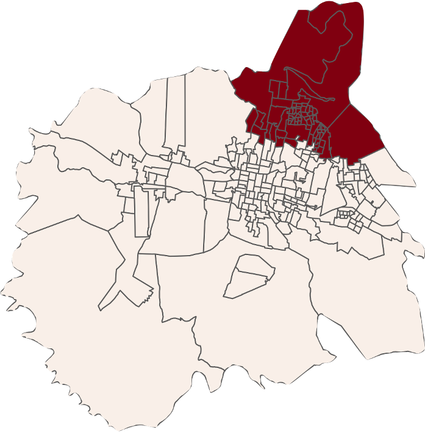
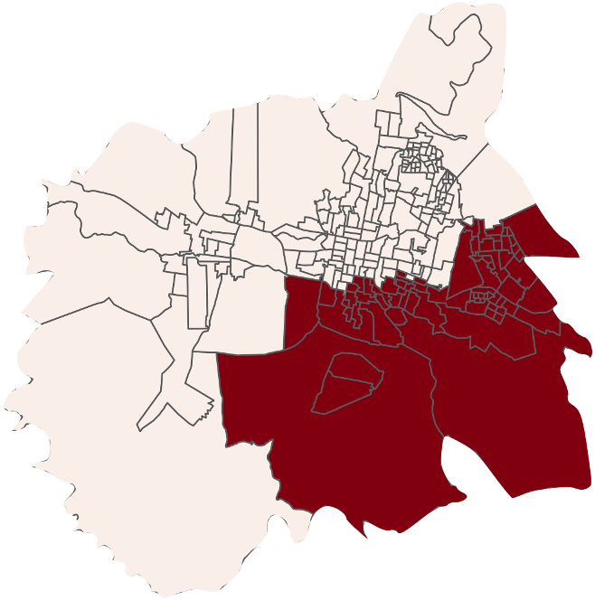
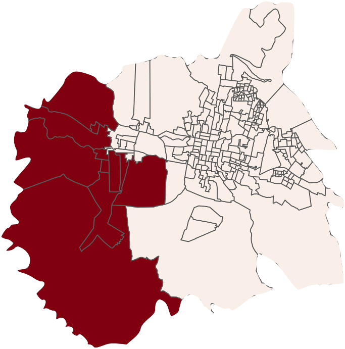

```{r include=F, echo=F, results=F}
library(tidyverse)
library(lubridate)
library(readxl)
library(sf)
library(magrittr)
library(survey)
library(highcharter)
library(here)

muestra <- st_read("Mayo 2021/muestra.shp" %>%  here())
seccion <- st_read("Mayo 2021/secciones_muestra.shp" %>%  here())

bd_m <- read_csv("Mayo 2021/cuotas.csv" %>%  here())
bd_m %<>%  mutate(seccion = SECCION, n = entrevistas)

eliminar <- read_csv("Mayo 2021/eliminar.csv" %>%  here())
bd <- read_xlsx("Mayo 2021/bd.xlsx" %>%  here()) %>%
  # filter(Date > ymd_hm("2021-04-24 13:00")) %>%
  anti_join(eliminar) 

codigos <- read_csv("Mayo 2021/codigos.csv" %>%  here())
bd %<>% set_names(codigos$pregunta)
bd  %<>% mutate(duracion = VEnd-VStart)

bd %<>% filter(duracion >= 2 )

bd <- bd %>% mutate(SECCION = as.numeric(SECCIO), MANZANA = as.numeric(MANZANA)) %>% 
  inner_join(muestra %>%  select(SECCION, MANZANA, estrt_n, part),
                        by = c("SECCION","MANZANA"))


# Aproximacion de probabilidad a la seccion.
bd <- muestra %>% as_tibble() %>%
  mutate(estrato_nombre =estrt_n) %>% 
  group_by(estrato_nombre, SECCION) %>% summarise(ln=sum(ln)) %>%
  mutate(probabilidad_seccion=ln/sum(ln)) %>%
  select(SECCION, probabilidad_seccion) %>%
  inner_join(bd)
# Aproximación de probabilidad de la manzana
auxiliar <- muestra %>%
  filter(SECCION %in% unique(bd$SECCION)) %>%
  group_by(SECCION) %>%
  summarise(n=n())
auxiliar2 <- bd %>% group_by(SECCION, MANZANA) %>%
  summarise(n()) %>%
  summarise(n_manzanas = n())
bd <- bd %>% inner_join(auxiliar %>% inner_join(auxiliar2, by="SECCION") %>%
                          as_tibble() %>%
                          mutate(probabilidad_manzanas = n_manzanas/n) %>%
                          select(SECCION,probabilidad_manzanas))


diseño_complejo <- survey::svydesign(ids = ~SECCION+MANZANA,
                                     data = bd,
                                     probs = ~probabilidad_seccion+probabilidad_manzanas,
                                     strata = ~estrato_nombre,
                                     nest = T)

vot <- bd %>% group_by(sexo, edad) %>%
  summarise(Freq=sum(part))
diseño<-postStratify(diseño_complejo,
                                 ~sexo+edad,
                                 partial = T,
                                 population = vot)


estrato_n <- muestra %>%  as_tibble() %>% group_by(SECCION, estrt_n) %>%  summarise()
bd %<>%mutate(SECCION = as.numeric(SECCIO)) %>%  left_join(estrato_n, by = c("SECCION"))
```

```{r include=F, echo=F, results=F}

otro <- "#7A898C"
ns <- "#7A898C"
base <- "#6F324E"
muymal <- "#D46D61"
mal <- "#E89680"
regular <- "#F0CB86"
bien <- "#BCD1A3"
muybien <- "#8FC798"
pri <- "#C41F1F"
pan <- "#254EA1"
morena <-"#75123B"
mc <- "#ED8632"
pt <- "#E62525"
rsp <- "#C94949"
psd<- "#D95543"
prd <- "#F2B21D"
pvem <- "#55AB5D"
fxm <- "#E080A7"
no <- "#39434F"
pes <- "#6D3482"
cxq <- "#1F9AA3"
ind <- "#B4C9E0"
mas = pes

tema<- hc_theme(
  colors = c("#6F324E","#91294F","#9F4261", "#" ),
  chart = list( style = list(fontFamily = "Avenir next", fontSize = "20px")),
  title = list( style = list(  color = "#453847", fontSize = "22px", fontWeight= 'bold')),
  subtitle = list(  style = list(    color = "#666666"  ) ),
  legend = list( itemStyle = list(  color = "black"   ),
                 itemHoverStyle = list( color = "gray")  ),
  tooltip = list(borderWidth =0, shadow = F,
                 # headerFormat= '',
                 headerFormat= '<span style="font-size: 20px">{point.key}</span><br>',
                 pointFormat = ' <b> {point.y}% </b>',
                 shape = "square",
                 # backgroundColor = "transparent",
                 style = list( fontSize = "16px", fontFamily = "Avenir next")),
  yAxis = list(lineWidth = 3,
               title = list(enabled = F, style= list(fontSize = "16px")),
               tickAmount = 5,
               labels = list(style= list(fontSize = "15px"),
                             format="{value:,.0f}%" )),
  xAxis = list(lineWidth = 0,
               title = list(enabled = F,style= list(fontSize = "16px")),
               labels = list(style= list(fontSize = "18px"))),
  plotOptions = list(bar = list(borderRadius =4, colorByPoint=T),
                     column = list(borderRadius =4),
                     scatter = list(marker = list(radius = 8)),
                     treemap = list(borderRadius =5,
                                    dataLabels = list(style = list(fontFamily = "Avenir next", fontSize = "16px"))),
                     errorbar = list(maxPointWidth = 20),
                     series = list(dataLabels = list(enabled = T,
                                                     style = list(fontSize = "16px"),
                                                     format = '{point.y}%')))
  
)


```


class: center, middle

# Encuesta en vivienda
### Tuxtla Gutiérrez, Chiapas


---
class: center, top
### 

#### Resultados generales
```{r include=T, echo=F, warning=F,message=F }
svymean(design= diseño,  ~emocion ) %>% 
  as_tibble(rownames = "x") %>%
  mutate(x=gsub(pattern = "emocion|:| \\(No leer\\)",
                x =x, replacement = ""),
         mean = round(mean,digits =  2)*100) %>% 
  arrange(desc(mean)) %>% 
  filter(mean>0) %>% 
  hchart(hcaes(x = x, y = mean), type = "bar") %>% 
  hc_title(text = "Pensando en cómo se ha sentido en la última semana, ¿qué emoción describe mejor su estado
de ánimo?") %>% 
  hc_add_theme(tema) %>% 
  hc_tooltip(enabled= F) %>% 
  hc_colors(c(rep(base,5), otro, base, base,base, ns))

```

---
class: center, top

#### Resultados generales
```{r include=T, echo=F, warning=F,message=F }
svymean(design= diseño,  ~propaganda ) %>% 
  as_tibble(rownames = "x") %>%
  mutate(x=gsub(pattern = "propaganda|:| \\(No leer\\)",
                x =x, replacement = ""),
         mean = round(mean,digits =  2)*100) %>% 
  arrange(desc(mean)) %>% 
  filter(mean>0) %>% 
  hchart(hcaes(x = x, y = mean), type = "bar") %>% 
  hc_title(text = "De acuerdo con lo que recuerda, ¿de qué partido político ha visto más propaganda para
Presidente Municipal de Tuxtla?") %>% 
  hc_add_theme(tema) %>% 
  hc_tooltip(enabled= F) %>% 
  hc_colors(c(morena, pri, ns, pan, ns, mc, otro, pvem, prd))

```
---
class: center, top

#### Resultados generales
```{r include=T, echo=F, warning=F,message=F }
svymean(design= diseño,  ~campana ) %>% 
  as_tibble(rownames = "x") %>%
  mutate(x=gsub(pattern = "campana|:| \\(No leer\\)",
                x =x, replacement = ""),
         mean = round(mean,digits =  2)*100) %>% 
  arrange(desc(mean)) %>% 
  filter(mean>0) %>% 
  hchart(hcaes(x = x, y = mean), type = "bar") %>% 
  hc_title(text = "De acuerdo con sus preferencias personales, ¿de qué partido político le gusta más su
campaña electoral para Presidente Municipal de Tuxtla?") %>% 
  hc_add_theme(tema) %>% 
  hc_tooltip(enabled= F) %>% 
  hc_colors(c(morena, ns, ns, pri, mc, otro, pan, pvem, prd))


```
---

class: center, top

#### Resultados generales
```{r include=T, echo=F, warning=F,message=F }

svymean(~voto, diseño) %>% as_tibble(rownames = "x") %>% 
  mutate(x = gsub("voto| \\(No leer\\)|","",x),
         mean = round(mean,digits =  2)*100) %>% 
  arrange(desc(mean)) %>% 
  filter(mean>0) %>% 
  hchart(hcaes(x = x, y = mean ), type = "bar") %>% 
  hc_title(text = "¿Qué tan seguro está de asistir a votar en las próximas elecciones del 6 de junio?
") %>% 
  hc_add_theme(tema) %>% 
  hc_plotOptions(column = list(colorByPoint = T)) %>%
  hc_tooltip(enabled = F) %>% 
  hc_colors(c(muybien, regular, mal, ns))


```

---
class: center, top

#### Resultados generales
```{r include=T, echo=F, warning=F,message=F }

svymean(~candidato, diseño) %>% as_tibble(rownames = "x") %>% 
  mutate(x = gsub("candidato| \\(No leer\\)|:","",x),
         mean = round(mean,digits =  2)*100) %>% 
  
  arrange(desc(mean)) %>% 
  filter(mean>0) %>% 
  hchart(hcaes(x = x, y = mean ), type = "bar") %>% 
  hc_title(text = "Si hoy fueran las elecciones para presidente municipal de Tuxtla Gutiérrez, ¿por quién votaría usted?") %>% 
  hc_add_theme(tema) %>% 
  hc_tooltip(enabled = F) %>% 
  hc_xAxis(labels = list(style = list(fontSize = "13px"))) %>% 
  hc_colors(c(morena, ns, pri, mc, ns, otro, pvem, ns))

```
---
class: center, top

#### Resultados generales
```{r include=T, echo=F, warning=F,message=F }
svytotal(~candidato, diseño) %>% as_tibble(rownames = "x") %>% 
  mutate(x = gsub("candidato| \\(No leer\\)|:","",x)) %>% 
  filter(!x %in% c("Ninguno","No contesta","No sabe","No sabe / No contesta",
                   "No votará", "Anulará su voto")) %>% 
  mutate(mean =round(total / sum(total)*100)) %>% 
  arrange(desc(mean)) %>% 
  filter(mean>0) %>% 
  hchart(hcaes(x = x, y = mean ), type = "bar") %>% 
  hc_title(text = "Si hoy fueran las elecciones para presidente municipal de Tuxtla Gutiérrez, ¿por quién votaría usted?") %>% 
  hc_subtitle(text = "Votación efectiva") %>%
  hc_add_theme(tema) %>% 
  hc_tooltip(enabled = F) %>% 
  hc_xAxis(labels = list(style = list(fontSize = "13px"))) %>% 
  hc_colors(c(morena,pri, mc, otro, pvem))

```
---
class: center, top

#### Resultados generales
```{r include=T, echo=F, warning=F,message=F }
svymean(design= diseño,  ~candidato2) %>% 
  as_tibble(rownames = "x") %>%
  mutate(x=gsub(pattern = "candidato2",  x =x, replacement = ""),
         x = gsub(pattern = "| \\(No leer\\)|:|\\(No leer",replacement = "",x =  x), 
         mean = round(mean,digits =  2)*100) %>% 
  arrange(desc(mean)) %>% 
  filter(mean>0) %>% 
  hchart(hcaes(x = x, y = mean), type = "bar") %>% 
  hc_title(text = "¿Y por quién nunca votaría usted?") %>% 
  hc_xAxis(labels = list(style = list(fontSize = "13px"))) %>% 
  hc_add_theme(tema) %>% 
  hc_tooltip(enabled= F) %>% 
  hc_colors(c(pri, ns, morena, mc, ns, pvem, otro, ns, ns))

```
---
class: center, top

#### Resultados generales
```{r include=T, echo=F, warning=F,message=F }
svymean(~partido_iden, diseño) %>% as_tibble(rownames = "x") %>% 
  mutate(x = gsub("partido_iden| \\(No leer\\)|:","",x),
         mean = round(mean,digits =  2)*100) %>% 
  arrange(desc(mean)) %>% 
  filter(mean>0) %>% 
  hchart(hcaes(x = x, y = mean ), type = "bar") %>% 
  hc_title(text = "Independientemente de por quién ha votado en pasadas elecciones, ¿actualmente con cuál partido se siente usted más identificado?") %>% 
  hc_add_theme(tema) %>% 
  hc_tooltip(enabled = F) %>%
  hc_colors(c( morena, ns, pri, ns, mc, pan, pvem, otro, prd))


```
---

class: center, top

#### Resultados generales
```{r include=T, echo=F, warning=F,message=F }
svymean(~amlo, diseño) %>% as_tibble(rownames = "x") %>% 
  mutate(x = gsub("amlo| \\(No leer\\)|:","",x),
         mean = round(mean,digits =  2)*100) %>% 
  mutate(x = factor(x = x,levels = c("Aprueba mucho","Aprueba poco",
                                     "Desaprueba poco","Desaprueba mucho","No sabe / No contesta"))) %>% 
  arrange(x) %>% 
  hchart(hcaes(x = x, y = mean ), type = "column") %>% 
  hc_title(text = "En general, ¿usted aprueba o desaprueba la forma en que el presidente Andrés Manuel López Obrador realiza su trabajo?") %>% 
  hc_add_theme(tema) %>% 
  # hc_yAxis(max = 50) %>% 
  hc_tooltip(enabled = F) %>% 
  hc_plotOptions(column = list(colorByPoint = T)) %>% 
  hc_colors(c(muybien, bien, mal, muymal, ns))

```

---
class: center, top

#### Resultados generales
```{r include=T, echo=F, warning=F,message=F }

svymean(~presmun, diseño) %>% as_tibble(rownames = "x") %>% 
  mutate(x = gsub("presmun| \\(No leer\\)|:","",x),
         mean = round(mean,digits =  2)*100) %>% 
  mutate(x = factor(x = x,levels = c("Aprueba mucho","Aprueba poco","Desaprueba poco","Desaprueba mucho","No sabe / No contesta"))) %>% 
  arrange(x) %>% 
  hchart(hcaes(x = x, y = mean ), type = "column") %>% 
  hc_title(text = "En general, ¿usted aprueba o desaprueba la forma en que su presidente municipal Carlos Morales realiza su trabajo?") %>% 
  hc_add_theme(tema) %>% 
  hc_tooltip(enabled = F) %>% 
  hc_plotOptions(column = list(colorByPoint = T)) %>% 
  hc_colors(c(muybien, bien, mal, muymal, ns))


```
---
class:  inverse, center, middle


# Estrato - Centro oriente

---
class: center, top

#### Centro oriente
```{r include=T, echo=F, warning=F,message=F }
svymean(design= diseño %>%  subset(estrt_n == "Centro oriente"),  ~emocion ) %>% 
  as_tibble(rownames = "x") %>%
  mutate(x=gsub(pattern = "emocion|:| \\(No leer\\)",
                x =x, replacement = ""),
         mean = round(mean,digits =  2)*100) %>% 
  arrange(desc(mean)) %>% 
  filter(mean>0) %>% 
  hchart(hcaes(x = x, y = mean), type = "bar") %>% 
  hc_title(text = "Pensando en cómo se ha sentido en la última semana, ¿qué emoción describe mejor su estado
de ánimo?") %>% 
  hc_add_theme(tema) %>% 
  hc_tooltip(enabled= F) %>% 
  hc_colors(c(rep(base,7), otro, base, base, ns))

```

---
class: center, top

#### Centro oriente
```{r include=T, echo=F, warning=F,message=F }
svymean(design= diseño%>%  subset(estrt_n == "Centro oriente"),  ~propaganda ) %>% 
  as_tibble(rownames = "x") %>%
  mutate(x=gsub(pattern = "propaganda|:| \\(No leer\\)",
                x =x, replacement = ""),
         mean = round(mean,digits =  2)*100) %>% 
  arrange(desc(mean)) %>% 
  filter(mean>0) %>% 
  hchart(hcaes(x = x, y = mean), type = "bar") %>% 
  hc_title(text = "De acuerdo con lo que recuerda, ¿de qué partido político ha visto más propaganda para
Presidente Municipal de Tuxtla?") %>% 
  hc_add_theme(tema) %>% 
  hc_tooltip(enabled= F) %>% 
  hc_colors(c( pri, morena, ns, pan, ns, otro, mc, pvem))

```
---
class: center, top

#### Centro oriente
```{r include=T, echo=F, warning=F,message=F }
svymean(design= diseño%>%  subset(estrt_n == "Centro oriente"),  ~campana ) %>% 
  as_tibble(rownames = "x") %>%
  mutate(x=gsub(pattern = "campana|:| \\(No leer\\)",
                x =x, replacement = ""),
         mean = round(mean,digits =  2)*100) %>% 
  arrange(desc(mean)) %>% 
  filter(mean>0) %>% 
  hchart(hcaes(x = x, y = mean), type = "bar") %>% 
  hc_title(text = "De acuerdo con sus preferencias personales, ¿de qué partido político le gusta más su
campaña electoral para Presidente Municipal de Tuxtla?") %>% 
  hc_add_theme(tema) %>% 
  hc_tooltip(enabled= F) %>% 
  hc_colors(c(morena, ns, ns, pri, mc, otro, pan, pvem, prd))


```
---

class: center, top

#### Centro oriente
```{r include=T, echo=F, warning=F,message=F }

svymean(~voto, diseño%>%  subset(estrt_n == "Centro oriente")) %>% as_tibble(rownames = "x") %>% 
  mutate(x = gsub("voto| \\(No leer\\)|","",x),
         mean = round(mean,digits =  2)*100) %>% 
  arrange(desc(mean)) %>% 
  filter(mean>0) %>% 
  hchart(hcaes(x = x, y = mean ), type = "bar") %>% 
  hc_title(text = "¿Qué tan seguro está de asistir a votar en las próximas elecciones del 6 de junio?
") %>% 
  hc_add_theme(tema) %>% 
  hc_plotOptions(column = list(colorByPoint = T)) %>%
  hc_tooltip(enabled = F) %>% 
  hc_colors(c(muybien, regular, mal, ns))


```

---
class: center, top

#### Centro oriente
```{r include=T, echo=F, warning=F,message=F }

svymean(~candidato, diseño%>%  subset(estrt_n == "Centro oriente")) %>% as_tibble(rownames = "x") %>% 
  mutate(x = gsub("candidato| \\(No leer\\)|:","",x),
         mean = round(mean,digits =  2)*100) %>% 
  
  arrange(desc(mean)) %>% 
  filter(mean>0) %>% 
  hchart(hcaes(x = x, y = mean ), type = "bar") %>% 
  hc_title(text = "Si hoy fueran las elecciones para presidente municipal de Tuxtla Gutiérrez, ¿por quién votaría usted?") %>% 
  hc_add_theme(tema) %>% 
  hc_tooltip(enabled = F) %>% 
  hc_xAxis(labels = list(style = list(fontSize = "13px"))) %>% 
  hc_colors(c(morena, ns, pri, mc, ns, otro, pvem, ns))

```
---
class: center, top

#### Centro oriente
```{r include=T, echo=F, warning=F,message=F }
svytotal(~candidato, diseño%>%  subset(estrt_n == "Centro oriente")) %>% as_tibble(rownames = "x") %>% 
  mutate(x = gsub("candidato| \\(No leer\\)|:","",x)) %>% 
  filter(!x %in% c("Ninguno","No contesta","No sabe","No sabe / No contesta",
                   "No votará", "Anulará su voto")) %>% 
  mutate(mean =round(total / sum(total)*100)) %>% 
  arrange(desc(mean)) %>% 
  filter(mean>0) %>% 
  hchart(hcaes(x = x, y = mean ), type = "bar") %>% 
  hc_title(text = "Si hoy fueran las elecciones para presidente municipal de Tuxtla Gutiérrez, ¿por quién votaría usted?") %>% 
  hc_subtitle(text = "Votación efectiva") %>%
  hc_add_theme(tema) %>% 
  hc_tooltip(enabled = F) %>% 
  hc_xAxis(labels = list(style = list(fontSize = "13px"))) %>% 
  hc_colors(c(morena,pri, mc, otro, pvem))

```
---
class: center, top

#### Centro oriente
```{r include=T, echo=F, warning=F,message=F }
svymean(design= diseño%>%  subset(estrt_n == "Centro oriente"),  ~candidato2) %>% 
  as_tibble(rownames = "x") %>%
  mutate(x=gsub(pattern = "candidato2",  x =x, replacement = ""),
         x = gsub(pattern = "| \\(No leer\\)|:|\\(No leer",replacement = "",x =  x), 
         mean = round(mean,digits =  2)*100) %>% 
  arrange(desc(mean)) %>% 
  filter(mean>0) %>% 
  hchart(hcaes(x = x, y = mean), type = "bar") %>% 
  hc_title(text = "¿Y por quién nunca votaría usted?") %>% 
  hc_xAxis(labels = list(style = list(fontSize = "13px"))) %>% 
  hc_add_theme(tema) %>% 
  hc_tooltip(enabled= F) %>% 
  hc_colors(c(pri, ns, morena, mc, pvem,ns, ns, otro))

```
---
class: center, top

#### Centro oriente
```{r include=T, echo=F, warning=F,message=F }
svymean(~partido_iden, diseño%>%  subset(estrt_n == "Centro oriente")) %>% as_tibble(rownames = "x") %>% 
  mutate(x = gsub("partido_iden| \\(No leer\\)|:","",x),
         mean = round(mean,digits =  2)*100) %>% 
  arrange(desc(mean)) %>% 
  filter(mean>0) %>% 
  hchart(hcaes(x = x, y = mean ), type = "bar") %>% 
  hc_title(text = "Independientemente de por quién ha votado en pasadas elecciones, ¿actualmente con cuál partido se siente usted más identificado?") %>% 
  hc_add_theme(tema) %>% 
  hc_tooltip(enabled = F) %>%
  hc_colors(c( morena, ns, pri, ns, pvem,mc, otro, pan,prd))


```
---

class: center, top

#### Centro oriente
```{r include=T, echo=F, warning=F,message=F }
svymean(~amlo, diseño%>%  subset(estrt_n == "Centro oriente")) %>% as_tibble(rownames = "x") %>% 
  mutate(x = gsub("amlo| \\(No leer\\)|:","",x),
         mean = round(mean,digits =  2)*100) %>% 
  mutate(x = factor(x = x,levels = c("Aprueba mucho","Aprueba poco",
                                     "Desaprueba poco","Desaprueba mucho","No sabe / No contesta"))) %>% 
  arrange(x) %>% 
  hchart(hcaes(x = x, y = mean ), type = "column") %>% 
  hc_title(text = "En general, ¿usted aprueba o desaprueba la forma en que el presidente Andrés Manuel López Obrador realiza su trabajo?") %>% 
  hc_add_theme(tema) %>% 
  # hc_yAxis(max = 50) %>% 
  hc_tooltip(enabled = F) %>% 
  hc_plotOptions(column = list(colorByPoint = T)) %>% 
  hc_colors(c(muybien, bien, mal, muymal, ns))

```

---
class: center, top

#### Centro oriente
```{r include=T, echo=F, warning=F,message=F }

svymean(~presmun, diseño%>%  subset(estrt_n == "Centro oriente")) %>% as_tibble(rownames = "x") %>% 
  mutate(x = gsub("presmun| \\(No leer\\)|:","",x),
         mean = round(mean,digits =  2)*100) %>% 
  mutate(x = factor(x = x,levels = c("Aprueba mucho","Aprueba poco","Desaprueba poco","Desaprueba mucho","No sabe / No contesta"))) %>% 
  arrange(x) %>% 
  hchart(hcaes(x = x, y = mean ), type = "column") %>% 
  hc_title(text = "En general, ¿usted aprueba o desaprueba la forma en que su presidente municipal Carlos Morales realiza su trabajo?") %>% 
  hc_add_theme(tema) %>% 
  hc_tooltip(enabled = F) %>% 
  hc_plotOptions(column = list(colorByPoint = T)) %>% 
  hc_colors(c(muybien, bien, mal, muymal, ns))


```
---
class:  inverse, center, middle


# Estrato - Centro poniente

---
class: center, top

#### Centro poniente
```{r include=T, echo=F, warning=F,message=F }
svymean(design= diseño %>%  subset(estrt_n == "Centro poniente"),  ~emocion ) %>% 
  as_tibble(rownames = "x") %>%
  mutate(x=gsub(pattern = "emocion|:| \\(No leer\\)",
                x =x, replacement = ""),
         mean = round(mean,digits =  2)*100) %>% 
  arrange(desc(mean)) %>% 
  filter(mean>0) %>% 
  hchart(hcaes(x = x, y = mean), type = "bar") %>% 
  hc_title(text = "Pensando en cómo se ha sentido en la última semana, ¿qué emoción describe mejor su estado
de ánimo?") %>% 
  hc_add_theme(tema) %>% 
  hc_tooltip(enabled= F) %>% 
  hc_colors(c(rep(base,4), otro, base, base, ns, base))

```

---
class: center, top

#### Centro poniente
```{r include=T, echo=F, warning=F,message=F }
svymean(design= diseño%>%  subset(estrt_n == "Centro poniente"),  ~propaganda ) %>% 
  as_tibble(rownames = "x") %>%
  mutate(x=gsub(pattern = "propaganda|:| \\(No leer\\)",
                x =x, replacement = ""),
         mean = round(mean,digits =  2)*100) %>% 
  arrange(desc(mean)) %>% 
  filter(mean>0) %>% 
  hchart(hcaes(x = x, y = mean), type = "bar") %>% 
  hc_title(text = "De acuerdo con lo que recuerda, ¿de qué partido político ha visto más propaganda para
Presidente Municipal de Tuxtla?") %>% 
  hc_add_theme(tema) %>% 
  hc_tooltip(enabled= F) %>% 
  hc_colors(c(morena, ns, pan,ns ,pri, mc, otro, prd))

```
---
class: center, top

#### Centro poniente
```{r include=T, echo=F, warning=F,message=F }
svymean(design= diseño%>%  subset(estrt_n == "Centro poniente"),  ~campana ) %>% 
  as_tibble(rownames = "x") %>%
  mutate(x=gsub(pattern = "campana|:| \\(No leer\\)",
                x =x, replacement = ""),
         mean = round(mean,digits =  2)*100) %>% 
  arrange(desc(mean)) %>% 
  filter(mean>0) %>% 
  hchart(hcaes(x = x, y = mean), type = "bar") %>% 
  hc_title(text = "De acuerdo con sus preferencias personales, ¿de qué partido político le gusta más su campaña electoral para Presidente Municipal de Tuxtla?") %>% 
  hc_add_theme(tema) %>% 
  hc_tooltip(enabled= F) %>% 
  hc_colors(c(morena, ns, ns,mc,  pri, otro, pan))


```
---

class: center, top

#### Centro poniente
```{r include=T, echo=F, warning=F,message=F }

svymean(~voto, diseño%>%  subset(estrt_n == "Centro poniente")) %>% as_tibble(rownames = "x") %>% 
  mutate(x = gsub("voto| \\(No leer\\)|","",x),
         mean = round(mean,digits =  2)*100) %>% 
  arrange(desc(mean)) %>% 
  filter(mean>0) %>% 
  hchart(hcaes(x = x, y = mean ), type = "bar") %>% 
  hc_title(text = "¿Qué tan seguro está de asistir a votar en las próximas elecciones del 6 de junio?
") %>% 
  hc_add_theme(tema) %>% 
  hc_plotOptions(column = list(colorByPoint = T)) %>%
  hc_tooltip(enabled = F) %>% 
  hc_colors(c(muybien, regular, mal, ns))


```

---
class: center, top

#### Centro poniente
```{r include=T, echo=F, warning=F,message=F }

svymean(~candidato, diseño%>%  subset(estrt_n == "Centro poniente")) %>% as_tibble(rownames = "x") %>% 
  mutate(x = gsub("candidato| \\(No leer\\)|:","",x),
         mean = round(mean,digits =  2)*100) %>% 
  
  arrange(desc(mean)) %>% 
  filter(mean>0) %>% 
  hchart(hcaes(x = x, y = mean ), type = "bar") %>% 
  hc_title(text = "Si hoy fueran las elecciones para presidente municipal de Tuxtla Gutiérrez, ¿por quién votaría usted?") %>% 
  hc_add_theme(tema) %>% 
  hc_tooltip(enabled = F) %>% 
  hc_xAxis(labels = list(style = list(fontSize = "13px"))) %>% 
  hc_colors(c(morena,mc,  ns,ns,  pri, otro,  ns,ns))

```
---
class: center, top

#### Centro poniente
```{r include=T, echo=F, warning=F,message=F }
svytotal(~candidato, diseño%>%  subset(estrt_n == "Centro poniente")) %>% as_tibble(rownames = "x") %>% 
  mutate(x = gsub("candidato| \\(No leer\\)|:","",x)) %>% 
  filter(!x %in% c("Ninguno","No contesta","No sabe","No sabe / No contesta",
                   "No votará", "Anulará su voto")) %>% 
  mutate(mean =round(total / sum(total)*100)) %>% 
  arrange(desc(mean)) %>% 
  filter(mean>0) %>% 
  hchart(hcaes(x = x, y = mean ), type = "bar") %>% 
  hc_title(text = "Si hoy fueran las elecciones para presidente municipal de Tuxtla Gutiérrez, ¿por quién votaría usted?") %>% 
  hc_subtitle(text = "Votación efectiva") %>%
  hc_add_theme(tema) %>% 
  hc_tooltip(enabled = F) %>% 
  hc_xAxis(labels = list(style = list(fontSize = "13px"))) %>% 
  hc_colors(c(morena, mc, pri, otro))

```
---
class: center, top

#### Centro poniente
```{r include=T, echo=F, warning=F,message=F }
svymean(design= diseño%>%  subset(estrt_n == "Centro poniente"),  ~candidato2) %>% 
  as_tibble(rownames = "x") %>%
  mutate(x=gsub(pattern = "candidato2",  x =x, replacement = ""),
         x = gsub(pattern = "| \\(No leer\\)|:|\\(No leer",replacement = "",x =  x), 
         mean = round(mean,digits =  2)*100) %>% 
  arrange(desc(mean)) %>% 
  filter(mean>0) %>% 
  hchart(hcaes(x = x, y = mean), type = "bar") %>% 
  hc_title(text = "¿Y por quién nunca votaría usted?") %>% 
  hc_xAxis(labels = list(style = list(fontSize = "13px"))) %>% 
  hc_add_theme(tema) %>% 
  hc_tooltip(enabled= F) %>% 
  hc_colors(c(pri,mc,morena,  ns, ns, pvem, otro, ns,ns))

```
---
class: center, top

#### Centro poniente
```{r include=T, echo=F, warning=F,message=F }
svymean(~partido_iden, diseño%>%  subset(estrt_n == "Centro poniente")) %>% as_tibble(rownames = "x") %>% 
  mutate(x = gsub("partido_iden| \\(No leer\\)|:","",x),
         mean = round(mean,digits =  2)*100) %>% 
  arrange(desc(mean)) %>% 
  filter(mean>0) %>% 
  hchart(hcaes(x = x, y = mean ), type = "bar") %>% 
  hc_title(text = "Independientemente de por quién ha votado en pasadas elecciones, ¿actualmente con cuál partido se siente usted más identificado?") %>% 
  hc_add_theme(tema) %>% 
  hc_tooltip(enabled = F) %>%
  hc_colors(c( morena, ns,ns, pri,pan, otro, mc, pvem, prd))


```
---

class: center, top

#### Centro poniente
```{r include=T, echo=F, warning=F,message=F }
svymean(~amlo, diseño%>%  subset(estrt_n == "Centro poniente")) %>% as_tibble(rownames = "x") %>% 
  mutate(x = gsub("amlo| \\(No leer\\)|:","",x),
         mean = round(mean,digits =  2)*100) %>% 
  mutate(x = factor(x = x,levels = c("Aprueba mucho","Aprueba poco",
                                     "Desaprueba poco","Desaprueba mucho","No sabe / No contesta"))) %>% 
  arrange(x) %>% 
  hchart(hcaes(x = x, y = mean ), type = "column") %>% 
  hc_title(text = "En general, ¿usted aprueba o desaprueba la forma en que el presidente Andrés Manuel López Obrador realiza su trabajo?") %>% 
  hc_add_theme(tema) %>% 
  # hc_yAxis(max = 50) %>% 
  hc_tooltip(enabled = F) %>% 
  hc_plotOptions(column = list(colorByPoint = T)) %>% 
  hc_colors(c(muybien, bien, mal, muymal, ns))

```

---
class: center, top

#### Centro poniente
```{r include=T, echo=F, warning=F,message=F }

svymean(~presmun, diseño%>%  subset(estrt_n == "Centro poniente")) %>% as_tibble(rownames = "x") %>% 
  mutate(x = gsub("presmun| \\(No leer\\)|:","",x),
         mean = round(mean,digits =  2)*100) %>% 
  mutate(x = factor(x = x,levels = c("Aprueba mucho","Aprueba poco","Desaprueba poco","Desaprueba mucho","No sabe / No contesta"))) %>% 
  arrange(x) %>% 
  hchart(hcaes(x = x, y = mean ), type = "column") %>% 
  hc_title(text = "En general, ¿usted aprueba o desaprueba la forma en que su presidente municipal Carlos Morales realiza su trabajo?") %>% 
  hc_add_theme(tema) %>% 
  hc_tooltip(enabled = F) %>% 
  hc_plotOptions(column = list(colorByPoint = T)) %>% 
  hc_colors(c(muybien, bien, mal, muymal, ns))


```
---
class:  inverse, center, middle


# Estrato - Periferia Norte

---
class: center, top

#### Periferia Norte
```{r include=T, echo=F, warning=F,message=F }


svymean(design= diseño%>%  subset(estrt_n == "Periferia norte"),  ~emocion ) %>% 
  as_tibble(rownames = "x") %>%
  mutate(x=gsub(pattern = "emocion|:| \\(No leer\\)",
                x =x, replacement = ""),
         mean = round(mean,digits =  2)*100) %>% 
  arrange(desc(mean)) %>% 
  filter(mean>0) %>% 
  hchart(hcaes(x = x, y = mean), type = "bar") %>% 
  hc_title(text = "Pensando en cómo se ha sentido en la última semana, ¿qué emoción describe mejor su estado
de ánimo?") %>% 
  hc_add_theme(tema) %>% 
  hc_tooltip(enabled= F) %>% 
  hc_colors(c(rep(base,5), otro,ns, base, base, base))

```

---
class: center, top

#### Periferia Norte
```{r include=T, echo=F, warning=F,message=F }
svymean(design= diseño%>%  subset(estrt_n == "Periferia norte"),  ~propaganda ) %>% 
  as_tibble(rownames = "x") %>%
  mutate(x=gsub(pattern = "propaganda|:| \\(No leer\\)",
                x =x, replacement = ""),
         mean = round(mean,digits =  2)*100) %>% 
  arrange(desc(mean)) %>% 
  filter(mean>0) %>% 
  hchart(hcaes(x = x, y = mean), type = "bar") %>% 
  hc_title(text = "De acuerdo con lo que recuerda, ¿de qué partido político ha visto más propaganda para
Presidente Municipal de Tuxtla?") %>% 
  hc_add_theme(tema) %>% 
  hc_tooltip(enabled= F) %>% 
  hc_colors(c(morena, pri, ns, pan,  mc, ns, otro, pvem))

```
---
class: center, top

#### Periferia Norte
```{r include=T, echo=F, warning=F,message=F }
svymean(design= diseño%>%  subset(estrt_n == "Periferia norte"),  ~campana ) %>% 
  as_tibble(rownames = "x") %>%
  mutate(x=gsub(pattern = "campana|:| \\(No leer\\)",
                x =x, replacement = ""),
         mean = round(mean,digits =  2)*100) %>% 
  arrange(desc(mean)) %>% 
  filter(mean>0) %>% 
  hchart(hcaes(x = x, y = mean), type = "bar") %>% 
  hc_title(text = "De acuerdo con sus preferencias personales, ¿de qué partido político le gusta más su
campaña electoral para Presidente Municipal de Tuxtla?") %>% 
  hc_add_theme(tema) %>% 
  hc_tooltip(enabled= F) %>% 
  hc_colors(c(morena, ns, ns, pri, mc, otro, pan, pvem, prd))


```
---

class: center, top

#### Periferia Norte
```{r include=T, echo=F, warning=F,message=F }

svymean(~voto, diseño%>%  subset(estrt_n == "Periferia norte")) %>% as_tibble(rownames = "x") %>% 
  mutate(x = gsub("voto| \\(No leer\\)|","",x),
         mean = round(mean,digits =  2)*100) %>% 
  arrange(desc(mean)) %>% 
  filter(mean>0) %>% 
  hchart(hcaes(x = x, y = mean ), type = "bar") %>% 
  hc_title(text = "¿Qué tan seguro está de asistir a votar en las próximas elecciones del 6 de junio?
") %>% 
  hc_add_theme(tema) %>% 
  hc_plotOptions(column = list(colorByPoint = T)) %>%
  hc_tooltip(enabled = F) %>% 
  hc_colors(c(muybien, regular, mal, ns))


```

---
class: center, top

#### Periferia Norte
```{r include=T, echo=F, warning=F,message=F }

svymean(~candidato, diseño%>%  subset(estrt_n == "Periferia norte")) %>% as_tibble(rownames = "x") %>% 
  mutate(x = gsub("candidato| \\(No leer\\)|:","",x),
         mean = round(mean,digits =  2)*100) %>% 
  
  arrange(desc(mean)) %>% 
  filter(mean>0) %>% 
  hchart(hcaes(x = x, y = mean ), type = "bar") %>% 
  hc_title(text = "Si hoy fueran las elecciones para presidente municipal de Tuxtla Gutiérrez, ¿por quién votaría usted?") %>% 
  hc_add_theme(tema) %>% 
  hc_tooltip(enabled = F) %>% 
  hc_xAxis(labels = list(style = list(fontSize = "13px"))) %>% 
  hc_colors(c(morena, pri, ns, mc, ns, otro,ns , ns))

```
---
class: center, top

#### Periferia Norte
```{r include=T, echo=F, warning=F,message=F }
svytotal(~candidato, diseño%>%  subset(estrt_n == "Periferia norte")) %>% as_tibble(rownames = "x") %>% 
  mutate(x = gsub("candidato| \\(No leer\\)|:","",x)) %>% 
  filter(!x %in% c("Ninguno","No contesta","No sabe","No sabe / No contesta",
                   "No votará", "Anulará su voto")) %>% 
  mutate(mean =round(total / sum(total)*100)) %>% 
  arrange(desc(mean)) %>% 
  filter(mean>0) %>% 
  hchart(hcaes(x = x, y = mean ), type = "bar") %>% 
  hc_title(text = "Si hoy fueran las elecciones para presidente municipal de Tuxtla Gutiérrez, ¿por quién votaría usted?") %>% 
  hc_subtitle(text = "Votación efectiva") %>%
  hc_add_theme(tema) %>% 
  hc_tooltip(enabled = F) %>% 
  hc_xAxis(labels = list(style = list(fontSize = "13px"))) %>% 
  hc_colors(c(morena,pri, mc, otro, pvem))

```
---
class: center, top

#### Periferia Norte
```{r include=T, echo=F, warning=F,message=F }
svymean(design= diseño%>%  subset(estrt_n == "Periferia norte"),  ~candidato2) %>% 
  as_tibble(rownames = "x") %>%
  mutate(x=gsub(pattern = "candidato2",  x =x, replacement = ""),
         x = gsub(pattern = "| \\(No leer\\)|:|\\(No leer",replacement = "",x =  x), 
         mean = round(mean,digits =  2)*100) %>% 
  arrange(desc(mean)) %>% 
  filter(mean>0) %>% 
  hchart(hcaes(x = x, y = mean), type = "bar") %>% 
  hc_title(text = "¿Y por quién nunca votaría usted?") %>% 
  hc_xAxis(labels = list(style = list(fontSize = "13px"))) %>% 
  hc_add_theme(tema) %>% 
  hc_tooltip(enabled= F) %>% 
  hc_colors(c(pri,  morena, mc, ns,ns, pvem, otro))

```
---
class: center, top

#### Periferia Norte
```{r include=T, echo=F, warning=F,message=F }
svymean(~partido_iden, diseño%>%  subset(estrt_n == "Periferia norte")) %>% as_tibble(rownames = "x") %>% 
  mutate(x = gsub("partido_iden| \\(No leer\\)|:","",x),
         mean = round(mean,digits =  2)*100) %>% 
  arrange(desc(mean)) %>% 
  filter(mean>0) %>% 
  hchart(hcaes(x = x, y = mean ), type = "bar") %>% 
  hc_title(text = "Independientemente de por quién ha votado en pasadas elecciones, ¿actualmente con cuál partido se siente usted más identificado?") %>% 
  hc_add_theme(tema) %>% 
  hc_tooltip(enabled = F) %>%
  hc_colors(c( morena, ns, pri, ns, mc, pan, pvem, otro, prd))


```
---

class: center, top

#### Periferia Norte
```{r include=T, echo=F, warning=F,message=F }
svymean(~amlo, diseño%>%  subset(estrt_n == "Periferia norte")) %>% as_tibble(rownames = "x") %>% 
  mutate(x = gsub("amlo| \\(No leer\\)|:","",x),
         mean = round(mean,digits =  2)*100) %>% 
  mutate(x = factor(x = x,levels = c("Aprueba mucho","Aprueba poco",
                                     "Desaprueba poco","Desaprueba mucho","No sabe / No contesta"))) %>% 
  arrange(x) %>% 
  hchart(hcaes(x = x, y = mean ), type = "column") %>% 
  hc_title(text = "En general, ¿usted aprueba o desaprueba la forma en que el presidente Andrés Manuel López Obrador realiza su trabajo?") %>% 
  hc_add_theme(tema) %>% 
  # hc_yAxis(max = 50) %>% 
  hc_tooltip(enabled = F) %>% 
  hc_plotOptions(column = list(colorByPoint = T)) %>% 
  hc_colors(c(muybien, bien, mal, muymal, ns))

```

---
class: center, top

#### Periferia Norte
```{r include=T, echo=F, warning=F,message=F }

svymean(~presmun, diseño%>%  subset(estrt_n == "Periferia norte")) %>% as_tibble(rownames = "x") %>% 
  mutate(x = gsub("presmun| \\(No leer\\)|:","",x),
         mean = round(mean,digits =  2)*100) %>% 
  mutate(x = factor(x = x,levels = c("Aprueba mucho","Aprueba poco","Desaprueba poco","Desaprueba mucho","No sabe / No contesta"))) %>% 
  arrange(x) %>% 
  hchart(hcaes(x = x, y = mean ), type = "column") %>% 
  hc_title(text = "En general, ¿usted aprueba o desaprueba la forma en que su presidente municipal Carlos Morales realiza su trabajo?") %>% 
  hc_add_theme(tema) %>% 
  hc_tooltip(enabled = F) %>% 
  hc_plotOptions(column = list(colorByPoint = T)) %>% 
  hc_colors(c(muybien, bien, mal, muymal, ns))


```
---
class:  inverse, center, middle


# Estrato - Periferia sur oriente

---
class: center, top

#### Periferia sur oriente
```{r include=T, echo=F, warning=F,message=F }
svymean(design= diseño%>%  subset(estrt_n == "Periferia sur oriente"),  ~emocion ) %>% 
  as_tibble(rownames = "x") %>%
  mutate(x=gsub(pattern = "emocion|:| \\(No leer\\)",
                x =x, replacement = ""),
         mean = round(mean,digits =  2)*100) %>% 
  arrange(desc(mean)) %>% 
  filter(mean>0) %>% 
  hchart(hcaes(x = x, y = mean), type = "bar") %>% 
  hc_title(text = "Pensando en cómo se ha sentido en la última semana, ¿qué emoción describe mejor su estado
de ánimo?") %>% 
  hc_add_theme(tema) %>% 
  hc_tooltip(enabled= F) %>% 
  hc_colors(c(rep(base,5), otro, base, base, ns))

```

---
class: center, top

#### Periferia sur oriente
```{r include=T, echo=F, warning=F,message=F }
svymean(design= diseño%>%  subset(estrt_n == "Periferia sur oriente"),  ~propaganda ) %>% 
  as_tibble(rownames = "x") %>%
  mutate(x=gsub(pattern = "propaganda|:| \\(No leer\\)",
                x =x, replacement = ""),
         mean = round(mean,digits =  2)*100) %>% 
  arrange(desc(mean)) %>% 
  filter(mean>0) %>% 
  hchart(hcaes(x = x, y = mean), type = "bar") %>% 
  hc_title(text = "De acuerdo con lo que recuerda, ¿de qué partido político ha visto más propaganda para
Presidente Municipal de Tuxtla?") %>% 
  hc_add_theme(tema) %>% 
  hc_tooltip(enabled= F) %>% 
  hc_colors(c(morena, pri, ns, ns, mc, pan,  otro, pvem, prd))

```
---
class: center, top

#### Periferia sur oriente
```{r include=T, echo=F, warning=F,message=F }
svymean(design= diseño%>%  subset(estrt_n == "Periferia sur oriente"),  ~campana ) %>% 
  as_tibble(rownames = "x") %>%
  mutate(x=gsub(pattern = "campana|:| \\(No leer\\)",
                x =x, replacement = ""),
         mean = round(mean,digits =  2)*100) %>% 
  arrange(desc(mean)) %>% 
  filter(mean>0) %>% 
  hchart(hcaes(x = x, y = mean), type = "bar") %>% 
  hc_title(text = "De acuerdo con sus preferencias personales, ¿de qué partido político le gusta más su
campaña electoral para Presidente Municipal de Tuxtla?") %>% 
  hc_add_theme(tema) %>% 
  hc_tooltip(enabled= F) %>% 
  hc_colors(c(morena, ns,  pri,ns,  mc, otro, pan, pvem, prd))


```
---

class: center, top

#### Periferia sur oriente
```{r include=T, echo=F, warning=F,message=F }

svymean(~voto, diseño%>%  subset(estrt_n == "Periferia sur oriente")) %>% as_tibble(rownames = "x") %>% 
  mutate(x = gsub("voto| \\(No leer\\)|","",x),
         mean = round(mean,digits =  2)*100) %>% 
  arrange(desc(mean)) %>% 
  filter(mean>0) %>% 
  hchart(hcaes(x = x, y = mean ), type = "bar") %>% 
  hc_title(text = "¿Qué tan seguro está de asistir a votar en las próximas elecciones del 6 de junio?
") %>% 
  hc_add_theme(tema) %>% 
  hc_plotOptions(column = list(colorByPoint = T)) %>%
  hc_tooltip(enabled = F) %>% 
  hc_colors(c(muybien, regular, mal, ns))


```

---
class: center, top

#### Periferia sur oriente
```{r include=T, echo=F, warning=F,message=F }

svymean(~candidato, diseño%>%  subset(estrt_n == "Periferia sur oriente")) %>% as_tibble(rownames = "x") %>% 
  mutate(x = gsub("candidato| \\(No leer\\)|:","",x),
         mean = round(mean,digits =  2)*100) %>% 
  
  arrange(desc(mean)) %>% 
  filter(mean>0) %>% 
  hchart(hcaes(x = x, y = mean ), type = "bar") %>% 
  hc_title(text = "Si hoy fueran las elecciones para presidente municipal de Tuxtla Gutiérrez, ¿por quién votaría usted?") %>% 
  hc_add_theme(tema) %>% 
  hc_tooltip(enabled = F) %>% 
  hc_xAxis(labels = list(style = list(fontSize = "13px"))) %>% 
  hc_colors(c(morena, ns, ns, pri, mc, otro, pvem, ns))

```
---
class: center, top

#### Periferia sur oriente
```{r include=T, echo=F, warning=F,message=F }
svytotal(~candidato, diseño%>%  subset(estrt_n == "Periferia sur oriente")) %>% as_tibble(rownames = "x") %>% 
  mutate(x = gsub("candidato| \\(No leer\\)|:","",x)) %>% 
  filter(!x %in% c("Ninguno","No contesta","No sabe","No sabe / No contesta",
                   "No votará", "Anulará su voto")) %>% 
  mutate(mean =round(total / sum(total)*100)) %>% 
  arrange(desc(mean)) %>% 
  filter(mean>0) %>% 
  hchart(hcaes(x = x, y = mean ), type = "bar") %>% 
  hc_title(text = "Si hoy fueran las elecciones para presidente municipal de Tuxtla Gutiérrez, ¿por quién votaría usted?") %>% 
  hc_subtitle(text = "Votación efectiva") %>%
  hc_add_theme(tema) %>% 
  hc_tooltip(enabled = F) %>% 
  hc_xAxis(labels = list(style = list(fontSize = "13px"))) %>% 
  hc_colors(c(morena,pri, mc, otro, pvem))

```
---
class: center, top

#### Periferia sur oriente
```{r include=T, echo=F, warning=F,message=F }
svymean(design= diseño%>%  subset(estrt_n == "Periferia sur oriente"),  ~candidato2) %>% 
  as_tibble(rownames = "x") %>%
  mutate(x=gsub(pattern = "candidato2",  x =x, replacement = ""),
         x = gsub(pattern = "| \\(No leer\\)|:|\\(No leer",replacement = "",x =  x), 
         mean = round(mean,digits =  2)*100) %>% 
  arrange(desc(mean)) %>% 
  filter(mean>0) %>% 
  hchart(hcaes(x = x, y = mean), type = "bar") %>% 
  hc_title(text = "¿Y por quién nunca votaría usted?") %>% 
  hc_xAxis(labels = list(style = list(fontSize = "13px"))) %>% 
  hc_add_theme(tema) %>% 
  hc_tooltip(enabled= F) %>% 
  hc_colors(c(pri, ns, morena, mc, ns, pvem, otro, ns, ns))

```
---
class: center, top

#### Periferia sur oriente
```{r include=T, echo=F, warning=F,message=F }
svymean(~partido_iden, diseño%>%  subset(estrt_n == "Periferia sur oriente")) %>% as_tibble(rownames = "x") %>% 
  mutate(x = gsub("partido_iden| \\(No leer\\)|:","",x),
         mean = round(mean,digits =  2)*100) %>% 
  arrange(desc(mean)) %>% 
  filter(mean>0) %>% 
  hchart(hcaes(x = x, y = mean ), type = "bar") %>% 
  hc_title(text = "Independientemente de por quién ha votado en pasadas elecciones, ¿actualmente con cuál partido se siente usted más identificado?") %>% 
  hc_add_theme(tema) %>% 
  hc_tooltip(enabled = F) %>%
  hc_colors(c( morena, ns, pri, ns, mc, otro, pan, pvem,  prd))


```
---

class: center, top

#### Periferia sur oriente
```{r include=T, echo=F, warning=F,message=F }
svymean(~amlo, diseño%>%  subset(estrt_n == "Periferia sur oriente")) %>% as_tibble(rownames = "x") %>% 
  mutate(x = gsub("amlo| \\(No leer\\)|:","",x),
         mean = round(mean,digits =  2)*100) %>% 
  mutate(x = factor(x = x,levels = c("Aprueba mucho","Aprueba poco",
                                     "Desaprueba poco","Desaprueba mucho","No sabe / No contesta"))) %>% 
  arrange(x) %>% 
  hchart(hcaes(x = x, y = mean ), type = "column") %>% 
  hc_title(text = "En general, ¿usted aprueba o desaprueba la forma en que el presidente Andrés Manuel López Obrador realiza su trabajo?") %>% 
  hc_add_theme(tema) %>% 
  # hc_yAxis(max = 50) %>% 
  hc_tooltip(enabled = F) %>% 
  hc_plotOptions(column = list(colorByPoint = T)) %>% 
  hc_colors(c(muybien, bien, mal, muymal, ns))

```

---
class: center, top

#### Periferia sur oriente
```{r include=T, echo=F, warning=F,message=F }

svymean(~presmun, diseño%>%  subset(estrt_n == "Periferia sur oriente")) %>% as_tibble(rownames = "x") %>% 
  mutate(x = gsub("presmun| \\(No leer\\)|:","",x),
         mean = round(mean,digits =  2)*100) %>% 
  mutate(x = factor(x = x,levels = c("Aprueba mucho","Aprueba poco","Desaprueba poco","Desaprueba mucho","No sabe / No contesta"))) %>% 
  arrange(x) %>% 
  hchart(hcaes(x = x, y = mean ), type = "column") %>% 
  hc_title(text = "En general, ¿usted aprueba o desaprueba la forma en que su presidente municipal Carlos Morales realiza su trabajo?") %>% 
  hc_add_theme(tema) %>% 
  hc_tooltip(enabled = F) %>% 
  hc_plotOptions(column = list(colorByPoint = T)) %>% 
  hc_colors(c(muybien, bien, mal, muymal, ns))


```
---
class:  inverse, center, middle


# Estrato - Periferia sur poniente

---
class: center, top

#### Periferia sur poniente
```{r include=T, echo=F, warning=F,message=F }
svymean(design= diseño %>%  subset(estrt_n == "Periferia sur poniente"),  ~emocion ) %>% 
  as_tibble(rownames = "x") %>%
  mutate(x=gsub(pattern = "emocion|:| \\(No leer\\)",
                x =x, replacement = ""),
         mean = round(mean,digits =  2)*100) %>% 
  arrange(desc(mean)) %>% 
  filter(mean>0) %>% 
  hchart(hcaes(x = x, y = mean), type = "bar") %>% 
  hc_title(text = "Pensando en cómo se ha sentido en la última semana, ¿qué emoción describe mejor su estado
de ánimo?") %>% 
  hc_add_theme(tema) %>% 
  hc_tooltip(enabled= F) %>% 
  hc_colors(c(rep(base,3), otro, base, base, ns))

```

---
class: center, top

#### Periferia sur poniente
```{r include=T, echo=F, warning=F,message=F }
svymean(design= diseño %>%  subset(estrt_n == "Periferia sur poniente"),  ~propaganda ) %>% 
  as_tibble(rownames = "x") %>%
  mutate(x=gsub(pattern = "propaganda|:| \\(No leer\\)",
                x =x, replacement = ""),
         mean = round(mean,digits =  2)*100) %>% 
  arrange(desc(mean)) %>% 
  filter(mean>0) %>% 
  hchart(hcaes(x = x, y = mean), type = "bar") %>% 
  hc_title(text = "De acuerdo con lo que recuerda, ¿de qué partido político ha visto más propaganda para Presidente Municipal de Tuxtla?") %>% 
  hc_add_theme(tema) %>% 
  hc_tooltip(enabled= F) %>% 
  hc_colors(c(morena, pri, ns,ns,  pan, mc, otro, pvem, prd))

```
---
class: center, top

#### Periferia sur poniente
```{r include=T, echo=F, warning=F,message=F }
svymean(design= diseño %>%  subset(estrt_n == "Periferia sur poniente"),  ~campana ) %>% 
  as_tibble(rownames = "x") %>%
  mutate(x=gsub(pattern = "campana|:| \\(No leer\\)",
                x =x, replacement = ""),
         mean = round(mean,digits =  2)*100) %>% 
  arrange(desc(mean)) %>% 
  filter(mean>0) %>% 
  hchart(hcaes(x = x, y = mean), type = "bar") %>% 
  hc_title(text = "De acuerdo con sus preferencias personales, ¿de qué partido político le gusta más su
campaña electoral para Presidente Municipal de Tuxtla?") %>% 
  hc_add_theme(tema) %>% 
  hc_tooltip(enabled= F) %>% 
  hc_colors(c(morena, ns, mc,ns, pri, otro, pan, pvem, prd))


```
---

class: center, top

#### Periferia sur poniente
```{r include=T, echo=F, warning=F,message=F }

svymean(~voto, diseño %>%  subset(estrt_n == "Periferia sur poniente")) %>% as_tibble(rownames = "x") %>% 
  mutate(x = gsub("voto| \\(No leer\\)|","",x),
         mean = round(mean,digits =  2)*100) %>% 
  arrange(desc(mean)) %>% 
  filter(mean>0) %>% 
  hchart(hcaes(x = x, y = mean ), type = "bar") %>% 
  hc_title(text = "¿Qué tan seguro está de asistir a votar en las próximas elecciones del 6 de junio?
") %>% 
  hc_add_theme(tema) %>% 
  hc_plotOptions(column = list(colorByPoint = T)) %>%
  hc_tooltip(enabled = F) %>% 
  hc_colors(c(muybien, regular, mal, ns))


```

---
class: center, top

#### Periferia sur poniente
```{r include=T, echo=F, warning=F,message=F }

svymean(~candidato, diseño %>%  subset(estrt_n == "Periferia sur poniente")) %>% as_tibble(rownames = "x") %>% 
  mutate(x = gsub("candidato| \\(No leer\\)|:","",x),
         mean = round(mean,digits =  2)*100) %>% 
  
  arrange(desc(mean)) %>% 
  filter(mean>0) %>% 
  hchart(hcaes(x = x, y = mean ), type = "bar") %>% 
  hc_title(text = "Si hoy fueran las elecciones para presidente municipal de Tuxtla Gutiérrez, ¿por quién votaría usted?") %>% 
  hc_add_theme(tema) %>% 
  hc_tooltip(enabled = F) %>% 
  hc_xAxis(labels = list(style = list(fontSize = "13px"))) %>% 
  hc_colors(c(morena, ns, pri, mc, ns, otro, ns, pvem, ns))

```
---
class: center, top

#### Periferia sur poniente
```{r include=T, echo=F, warning=F,message=F }
svytotal(~candidato, diseño %>%  subset(estrt_n == "Periferia sur poniente")) %>% as_tibble(rownames = "x") %>% 
  mutate(x = gsub("candidato| \\(No leer\\)|:","",x)) %>% 
  filter(!x %in% c("Ninguno","No contesta","No sabe","No sabe / No contesta",
                   "No votará", "Anulará su voto")) %>% 
  mutate(mean =round(total / sum(total)*100)) %>% 
  arrange(desc(mean)) %>% 
  filter(mean>0) %>% 
  hchart(hcaes(x = x, y = mean ), type = "bar") %>% 
  hc_title(text = "Si hoy fueran las elecciones para presidente municipal de Tuxtla Gutiérrez, ¿por quién votaría usted?") %>% 
  hc_subtitle(text = "Votación efectiva") %>%
  hc_add_theme(tema) %>% 
  hc_tooltip(enabled = F) %>% 
  hc_xAxis(labels = list(style = list(fontSize = "13px"))) %>% 
  hc_colors(c(morena,pri, mc, otro, pvem))

```
---
class: center, top

#### Periferia sur poniente
```{r include=T, echo=F, warning=F,message=F }
svymean(design= diseño %>%  subset(estrt_n == "Periferia sur poniente"),  ~candidato2) %>% 
  as_tibble(rownames = "x") %>%
  mutate(x=gsub(pattern = "candidato2",  x =x, replacement = ""),
         x = gsub(pattern = "| \\(No leer\\)|:|\\(No leer",replacement = "",x =  x), 
         mean = round(mean,digits =  2)*100) %>% 
  arrange(desc(mean)) %>% 
  filter(mean>0) %>% 
  hchart(hcaes(x = x, y = mean), type = "bar") %>% 
  hc_title(text = "¿Y por quién nunca votaría usted?") %>% 
  hc_xAxis(labels = list(style = list(fontSize = "13px"))) %>% 
  hc_add_theme(tema) %>% 
  hc_tooltip(enabled= F) %>% 
  hc_colors(c(pri, mc, ns, ns, morena,  pvem,  ns, otro))

```
---
class: center, top

#### Periferia sur poniente
```{r include=T, echo=F, warning=F,message=F }
svymean(~partido_iden, diseño %>%  subset(estrt_n == "Periferia sur poniente")) %>% as_tibble(rownames = "x") %>% 
  mutate(x = gsub("partido_iden| \\(No leer\\)|:","",x),
         mean = round(mean,digits =  2)*100) %>% 
  arrange(desc(mean)) %>% 
  filter(mean>0) %>% 
  hchart(hcaes(x = x, y = mean ), type = "bar") %>% 
  hc_title(text = "Independientemente de por quién ha votado en pasadas elecciones, ¿actualmente con cuál partido se siente usted más identificado?") %>% 
  hc_add_theme(tema) %>% 
  hc_tooltip(enabled = F) %>%
  hc_colors(c( morena, ns,ns, pri,  mc,  pvem, pan, prd))


```
---

class: center, top

#### Periferia sur poniente
```{r include=T, echo=F, warning=F,message=F }
svymean(~amlo, diseño %>%  subset(estrt_n == "Periferia sur poniente")) %>% as_tibble(rownames = "x") %>% 
  mutate(x = gsub("amlo| \\(No leer\\)|:","",x),
         mean = round(mean,digits =  2)*100) %>% 
  mutate(x = factor(x = x,levels = c("Aprueba mucho","Aprueba poco",
                                     "Desaprueba poco","Desaprueba mucho","No sabe / No contesta"))) %>% 
  arrange(x) %>% 
  hchart(hcaes(x = x, y = mean ), type = "column") %>% 
  hc_title(text = "En general, ¿usted aprueba o desaprueba la forma en que el presidente Andrés Manuel López Obrador realiza su trabajo?") %>% 
  hc_add_theme(tema) %>% 
  # hc_yAxis(max = 50) %>% 
  hc_tooltip(enabled = F) %>% 
  hc_plotOptions(column = list(colorByPoint = T)) %>% 
  hc_colors(c(muybien, bien, mal, muymal, ns))

```

---
class: center, top

#### Periferia sur poniente
```{r include=T, echo=F, warning=F,message=F }

svymean(~presmun, diseño %>%  subset(estrt_n == "Periferia sur poniente")) %>% as_tibble(rownames = "x") %>% 
  mutate(x = gsub("presmun| \\(No leer\\)|:","",x),
         mean = round(mean,digits =  2)*100) %>% 
  mutate(x = factor(x = x,levels = c("Aprueba mucho","Aprueba poco","Desaprueba poco","Desaprueba mucho","No sabe / No contesta"))) %>% 
  arrange(x) %>% 
  hchart(hcaes(x = x, y = mean ), type = "column") %>% 
  hc_title(text = "En general, ¿usted aprueba o desaprueba la forma en que su presidente municipal Carlos Morales realiza su trabajo?") %>% 
  hc_add_theme(tema) %>% 
  hc_tooltip(enabled = F) %>% 
  hc_plotOptions(column = list(colorByPoint = T)) %>% 
  hc_colors(c(muybien, bien, mal, muymal, ns))


```
---

class:  inverse, center, middle

# Datos Sociodemográficos
---

class: center, top

```{r include=T, echo=F, warning=F,message=F }

svymean(~civil, diseño) %>% as_tibble(rownames = "x") %>% 
  mutate(x = gsub("civil| \\(No leer\\)|:","",x),
         mean = round(mean,digits =  2)*100) %>% 
  arrange(desc(mean)) %>% 
  hchart(hcaes(x = x, y = mean ), type = "bar") %>% 
  hc_title(text = "¿Cuál es su estado civil?") %>% 
  hc_add_theme(tema) %>% 
  hc_tooltip(enabled = F) %>% 
  hc_plotOptions(bar = list(colorByPoint = F)) 

```
---
class: center, top

```{r include=T, echo=F, warning=F,message=F }

svymean(~estudio, diseño) %>% as_tibble(rownames = "x") %>% 
  mutate(x = gsub("estudio| \\(No leer\\)|:","",x),
         mean = round(mean,digits =  2)*100) %>% 
  arrange(desc(mean)) %>% 
  hchart(hcaes(x = x, y = mean ), type = "bar") %>% 
  hc_title(text = "¿Cuál es su último grado de estudios concluido?") %>% 
  hc_add_theme(tema) %>% 
  hc_tooltip(enabled = F) %>% 
  hc_plotOptions(bar = list(colorByPoint = F)) 


```
---
class: center, top

```{r include=T, echo=F, warning=F,message=F }
svymean(~ocupacion, diseño) %>% as_tibble(rownames = "x") %>% 
  mutate(x = gsub("ocupacion| \\(No leer\\)|:","",x),
         mean = round(mean,digits =  2)*100) %>% 
  arrange(desc(mean)) %>% 
  filter(mean>0) %>% 
  hchart(hcaes(x = x, y = mean ), type = "bar") %>% 
  hc_title(text = "¿Cuál es su principal ocupación?") %>%
  hc_add_theme(tema) %>% 
  hc_tooltip(enabled = F) %>% 
  hc_xAxis(labels = list(style = list(fontSize = "14px"))) %>% 
  hc_plotOptions(bar = list(colorByPoint = F)) 


```


---
class: center, top

```{r include=T, echo=F, warning=F,message=F }
svymean(~cohabitantes, diseño) %>% as_tibble(rownames = "x") %>% 
  mutate(x = gsub("cohabitantes| \\(No leer\\)|:","",x),
         mean = round(mean,digits =  2)*100) %>% arrange(x) %>% 
  mutate(x = factor(x, c("1", "2", "3", "4", "5", "6", "7", "8",
                         "9", "10", "Más de 10", "No contesta"))) %>% 
  arrange(x) %>% 
  hchart(hcaes(x = x, y = mean ), type = "bar") %>% 
  hc_title(text = "En total y contándose usted, ¿cuántas personas viven en su casa?") %>% 
  hc_add_theme(tema)  %>% 
  hc_tooltip(enabled = F) %>% 
  hc_plotOptions(bar = list(colorByPoint = F)) 


```
---
class: left, top

## Metodología

 Tipo de estudio: Encuesta municipal en vivienda.

 Técnica de recolección de datos: Entrevistas personales (cara a cara) en vivienda utilizando un cuestionario estructurado aplicado por encuestadores en dispositivos electrónicos.

 Fecha de levantamiento: 15 - 18 de mayo del 2021.

 Universo de análisis: Mexicanos mayores a 18 años residentes en Tuxtla Gutiérrez, Chiapas.

 Tamaño de la muestra: `r nrow(bd)` entrevistas.

 Nivel de confianza estadístico: 95%.

 Margen de error: (+/-): 3.02%.

 Método de muestreo: Muestreo aleatorio polietápico, estratos según comportamiento electoral, conglomerados por manzana, vivienda y persona. Resultaron seleccionadas 18 secciones, de las cuales se tomaron 8 manzanas en cada una, y a cada manzana le corresponden 8 entrevistas.


